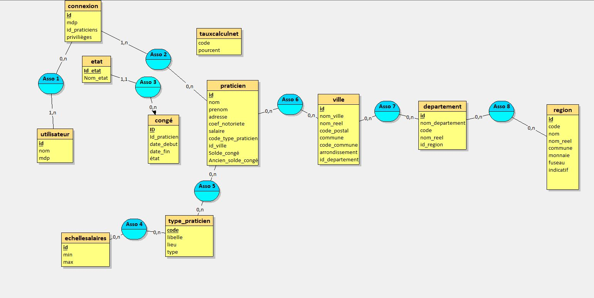
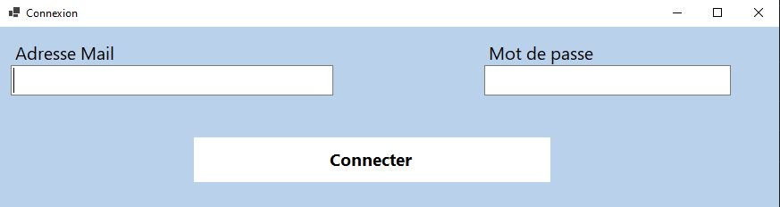
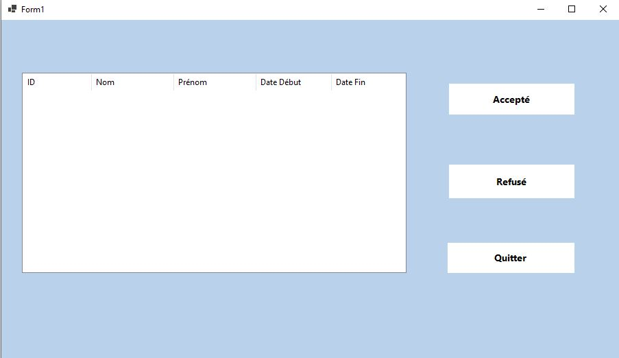

# Mission 1 : Application Desktop C# — GSBConge

## Présentation

### Objectif

**GSBConge** est une application desktop développée en **C# Windows Forms (.NET 8)**. Elle permet la gestion des demandes de congé des praticiens du réseau GSB (Groupement de Santé Bretagne).

L'application doit présenter :
- Une **page de connexion** sécurisée
- Une **interface praticien** pour consulter son solde de congé, soumettre des demandes et suivre leur état
- Une **interface RH** pour consulter, accepter ou refuser les demandes en attente
- Un **système de notifications** pour informer les praticiens des décisions RH

---

## Stack Technique

| Élément | Technologie |
|--------|-------------|
| Langage | C# |
| Framework | .NET 8.0 Windows Forms |
| Base de données | MySQL 9.4 |
| Connecteur BDD | MySqlConnector |
| Hachage mot de passe | BCrypt.Net-Next 4.0.3 |
| Type d'application | WinExe (Desktop Windows) |

---

## Architecture

```
GSBConge/
├── modele/
│   ├── Conge.cs              # Entité congé
│   └── Practicien.cs         # Entité praticien
├── BDD.cs                    # Couche d'accès aux données (interface IBDD)
├── Connexion.cs              # Formulaire de connexion
├── User.cs                   # Interface praticien
├── admin.cs                  # Interface RH / Admin
├── Program.cs                # Point d'entrée
├── GSBConge.csproj           # Fichier projet (.NET 8.0)
└── gsb.sql                   # Schéma et données de la base
```

---

## Base de données

### Schéma des entités

#### Praticien

| Champ | Type | Description |
|-------|------|-------------|
| `id` | int (PK) | Identifiant unique |
| `nom` | string | Nom de famille |
| `prenom` | string | Prénom |
| `id_ville` | int (FK) | Ville rattachée |
| `solde_congé` | decimal | Solde de congé disponible (en jours) |

#### Connexion (authentification)

| Champ | Type | Description |
|-------|------|-------------|
| `identifiant` | string | Email de connexion |
| `mdp` | string | Mot de passe haché (BCrypt) |
| `id_praticiens` | int (FK) | Praticien associé |
| `privilèges` | int | 1 = Admin RH, 2 = Praticien standard |

#### Congé

| Champ | Type | Description |
|-------|------|-------------|
| `id` | int (PK) | Identifiant unique |
| `id_praticien` | int (FK) | Praticien demandeur |
| `date_debut` | datetime | Date de début du congé |
| `date_fin` | datetime | Date de fin du congé |
| `état` | int | 1=En attente, 2=Accepté, 3=Refusé |

#### Notification

| Champ | Type | Description |
|-------|------|-------------|
| `id_notif` | int (PK) | Identifiant |
| `id_receveur` | int (FK) | Praticien destinataire |
| `message` | string | Contenu du message RH |
| `id_etat` | int | 1=Lu, 2=Non lu |

### MCD



### Procédures stockées et événements automatiques

La base de données intègre des **procédures stockées** déclenchées par des **événements MySQL** planifiés.

**Événement mensuel** — Crédite automatiquement 0,63 jour de congé à chaque praticien :

```sql title='Ajout congé mensuel'
BEGIN
    UPDATE praticien
    SET praticien.Solde_congé = praticien.Solde_congé + 0.63;
END
```

**Événement annuel** — Archive le solde actuel dans `Ancien_Solde_Congé` puis le remet à zéro :

```sql title='Remise à zéro annuelle'
BEGIN
    UPDATE praticien
    SET praticien.Ancien_Solde_Congé = praticien.Solde_congé,
        praticien.Solde_congé = 0;
END
```

---

## Description des interfaces

### Connexion



L'écran de connexion présente deux champs : **adresse mail** et **mot de passe**. Le mot de passe est vérifié avec BCrypt (aucun mot de passe n'est stocké en clair). Le champ `privilèges` détermine vers quelle interface l'utilisateur est redirigé après connexion.

### Interface Praticien


L'interface praticien permet de :
- Visualiser son **solde de congé** disponible (affiché en bas à droite)
- Sélectionner une **date de début** et une **date de fin** via des sélecteurs de date
- Soumettre une demande de congé (validée contre le solde disponible)
- Consulter l'état de ses demandes précédentes

À la connexion, si des **notifications non lues** existent, elles s'affichent sous forme de boîtes de dialogue successives avant d'accéder à l'interface.

### Interface RH / Admin



L'interface RH affiche une **ListView** listant toutes les demandes de congé en attente (état = 1). Chaque ligne contient l'ID, le nom, le prénom, la date de début et la date de fin du praticien. Pour traiter une demande, il suffit de la sélectionner puis de cliquer sur **Accepter** ou **Refuser**.

---

## Logique métier clé

### Validation du solde avant soumission

Avant d'enregistrer une demande, l'application calcule le nombre de jours demandés et vérifie que le solde disponible est suffisant :

```csharp title='Validation solde de congé'
double joursDemandeés = (dateFin - dateDebut).TotalDays;
if (joursDemandeés > praticien.SoldeConge)
{
    MessageBox.Show("Solde de congé insuffisant.");
    return;
}
```

### Chargement des demandes (interface Admin)

Au chargement de l'interface RH, toutes les demandes en attente sont récupérées depuis la base de données via une jointure avec la table `praticien`, puis affichées dans la ListView :

```csharp title='Admin_Load'
bdd = new BDD("AP", "APSIO2", "172.23.48.2", "gsb");
bdd.Connecter();
listeConge = bdd.ChargerConge();
lvadmin.View = View.Details;
lvadmin.Columns.Add("ID", 100);
lvadmin.Columns.Add("Nom", 120);
lvadmin.Columns.Add("Prénom", 120);
lvadmin.Columns.Add("Date Début", 110);
lvadmin.Columns.Add("Date Fin", 110);

foreach (Conge con in listeConge)
{
    if (con.etat == "1")
    {
        var item = new ListViewItem(con.id.ToString());
        item.SubItems.Add(con.praticien.nom);
        item.SubItems.Add(con.praticien.prenom);
        item.SubItems.Add(con.date_debut.ToString("yyyy-MM-dd"));
        item.SubItems.Add(con.date_fin.ToString("yyyy-MM-dd"));
        lvadmin.Items.Add(item);
    }
}
```

### Requête SQL — Chargement des congés

La méthode `ChargerConge()` de la couche `BDD` effectue une jointure entre `congé` et `praticien` pour récupérer uniquement les demandes en attente (état = 1) :

```csharp title='BDD.ChargerConge()'
string requete = @"
    SELECT c.id, c.id_praticien, c.date_debut, c.date_fin, c.état,
           p.nom, p.prenom, p.id_ville, p.solde_congé
    FROM congé c
    INNER JOIN praticien p ON c.id_praticien = p.id
    WHERE c.état = 1;";

cmd = new MySqlCommand(requete, connection);
reader = cmd.ExecuteReader();

while (reader.Read())
{
    Practicien prat = new Practicien(
        Convert.ToInt32(reader["id_praticien"]),
        reader["nom"].ToString(),
        reader["prenom"].ToString(),
        Convert.ToInt32(reader["id_ville"]),
        Convert.ToDecimal(reader["solde_congé"])
    );

    Conge conge = new Conge(
        Convert.ToInt32(reader["id"]),
        Convert.ToInt32(reader["id_praticien"]),
        Convert.ToDateTime(reader["date_debut"]),
        Convert.ToDateTime(reader["date_fin"]),
        reader["état"].ToString()
    );

    conge.praticien = prat;
    listeConge.Add(conge);
}
```

### Système de notifications

À chaque connexion d'un praticien, l'application vérifie s'il existe des **notifications non lues** (état = 2) à son attention. Elles s'affichent une par une sous forme de boîte de dialogue. Une fois lue (bouton OK), la notification est marquée comme lue en base :

```csharp title='Affichage des notifications non lues'
string requete = "SELECT id_notif, message FROM notification WHERE id_receveur = @id AND id_etat = 2";
MySqlCommand cmd = new MySqlCommand(requete, connection);
cmd.Parameters.AddWithValue("@id", idp);

using (MySqlDataReader reader = cmd.ExecuteReader())
{
    while (reader.Read())
    {
        string message = reader["message"].ToString();
        int idNotification = Convert.ToInt32(reader["id_notif"]);

        DialogResult result = MessageBox.Show(
            message,
            "Message du RH",
            MessageBoxButtons.OK,
            MessageBoxIcon.Information
        );

        if (result == DialogResult.OK)
        {
            reader.Close();
            MarquerCommeLu(idNotification); // UPDATE notification SET id_etat = 1
            AfficherMessage(idp);           // Vérifie s'il en reste d'autres
            break;
        }
    }
}
```
