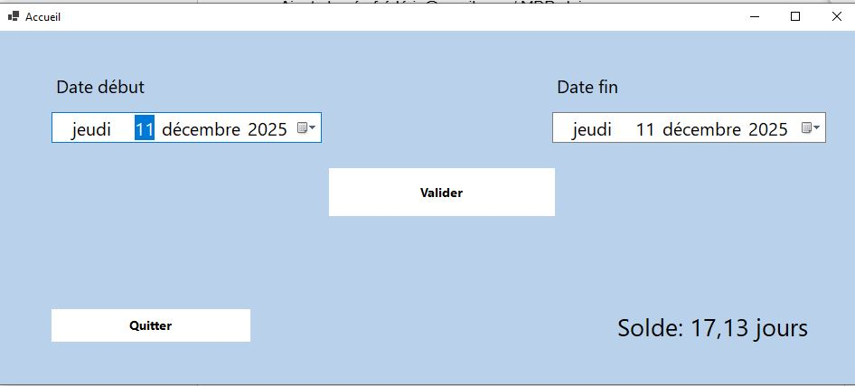

# Mission 1: Demande de congé C&#35;

## Présentation

### Objectif

Pour réussir la mission l'application doit présenter ceci:

- Une page de connexion
- Une page utilisateur pour pouvoir consulter son solde de congé, faire des demandes de congé et savoir si sa demande est accepter
- Une page RH qui permet d'accepter ou refuser les différents congé présent en attente.

## Base de donnée

Ci-joint la photo du MCD


On peut ajouter à ceci l'ajout de procedure stocké et des événements.

L'événements sert à remettre des nouveaux congé tout les X du mois et l'autre à faire chaque an le reset du soldes de congé.

Les procédures stocké sont appelé par les événements pour déclancher faire les modification.

### Contenu des procédures stocké

```sql title='Ajout Congé Mensuels'
BEGIN
    UPDATE praticien
    SET praticien.Solde_congé = praticien.Solde_congé + 0.63;
END
```

```sql title='Remise Congé Annuelle'
BEGIN
    UPDATE praticien
    SET praticien.Ancien_Solde_Congé = praticien.Solde_congé,
        praticien.Solde_congé = 0; -
END
```

## C&#35;

### Composition des pages

#### Connexion


Nous remarquons les deux champs possible, **adresse mail** et **mot de passe** qui existe pour chaque praticiens de la base de données.

#### Interface Utilisateur



Il y a deux champs important qui sont la **Date de début** et la **date de fin** pour demander les congé on remarque que en bas a droite on a le solde de congé actuellement.

#### Interface RH


On remarque une ListeView ou iront tout les praticiens qui demande des congé. Pour accepter il suffit de séléctionner et cliquer soit sur accepté ou sois refusé.

### Les parties complexe du codes
